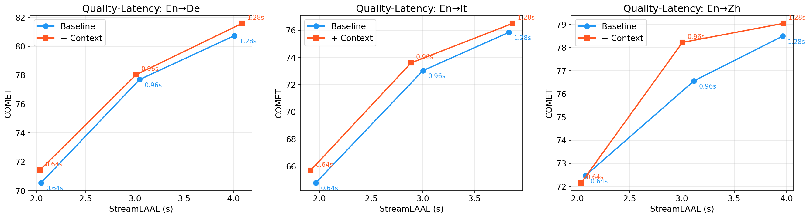

# IWSLT 2026 Simultaneous Translation Baseline

Baseline system for the [IWSLT 2026 Simultaneous Translation Track](https://iwslt.org/2026/simultaneous), **Speech-to-Text with Extra Context** subtrack.

This system implements a cascade-based streaming pipeline: **ASR** (Qwen3-ASR-1.7B) → **Translation** (Qwen3-4B-Instruct-2507), with optional context from paper. It evaluates quality-latency tradeoffs for English → Chinese / German / Italian.

Tested on the MCIF dataset, providing additional context consistently improves translation quality across all language pairs and latencies compared to the baseline.



## Environment Setup

Two conda environments are needed (separate due to dependency conflicts between inference and evaluation).

```bash
# Inference environment
conda create -y -n inference python=3.12
conda activate inference
pip install uv
uv pip install qwen-asr[vllm] simulstream simuleval pymupdf-layout pymupdf4llm jupyter nvitop pycryptodome mweralign

# Evaluation environment
conda create -y -n evaluation python=3.12
conda activate evaluation
pip install uv
# if you encounter evaluation error for CJK languages, try install simulstream from source
uv pip install simulstream[eval] setuptools==80.10.2
```

## Pipeline

The full pipeline has four stages:

```
PDFs → extract_abstract.py → ner_llm.py → infer_{baseline,abstract}.sh → eval.sh
```

### Step 1: Extract Abstracts from PDFs

Extract title, authors, and abstract text from each paper PDF.

```bash
conda activate inference
python extract_abstract.py data/pdf_paths.txt -o data/abstract_results.json
```

- Input: a text file with one PDF path per line
- Output: JSON array of `{"path": ..., "abstract": ...}` entries

### Step 2: Extract Named Entities

Use LLM-based majority voting to extract named entities from the abstracts. Samples N times per paper and keeps entities appearing in at least k samples for robustness.

```bash
conda activate inference
python ner_llm.py data/abstract_results.json -n 16 -k 8 -o data/ner_llm_results.json
```

- `-n` — number of LLM samples per paper (default: 16)
- `-k` — minimum sample count to keep an entity (default: 8)
- Output: JSON array of `{"path": ..., "entity_count": ..., "entities": [...]}` entries
- Requires a GPU to run the NER model (Qwen3-30B-A3B-Instruct-2507-FP8 via vLLM)

### Step 3: Run Simultaneous Translation Inference

The inference scripts generate a `speech_processor.yaml` config and run `simulstream_inference`.

```bash
conda activate inference
export PYTHONPATH="$(pwd):${PYTHONPATH:-}"

# each line is a relative wav file path
# e.g. audio/OiqEWDVtWk.wav
# if the file is under mcif-long-trans/
WAV_LIST_FILE=/path/to/wav_list

# === Configure these variables ===
TGT_LANG=Chinese           # Chinese, German, or Italian
TGT_LANG_CODE=zh           # zh, de, or it
LATENCY_UNIT=char          # char for zh, word for de/it
SACREBLEU_TOKENIZER=zh     # zh for zh, 13a for de/it
SEGMENT_SIZE=960           # 640, 960, or 1280 (ms), or other values
APPROACH=with-context      # baseline or with-context
NER_RESULTS_PATH=data/ner_llm_results.json # NER JSON for with-context approach, null for baseline

SPEECH_CHUNK_SIZE=$(awk "BEGIN { printf \"%.3f\", ${SEGMENT_SIZE}/1000 }")
OUT_DIR=outputs/en-${TGT_LANG_CODE}/${APPROACH}/seg${SEGMENT_SIZE}_mss5.0_h0
mkdir -p "$OUT_DIR"

# write the config to a speech processor file
cat > "${OUT_DIR}/speech_processor.yaml" <<EOF
type: "agent_simulstream.CascadeSpeechProcessor"
speech_chunk_size: ${SPEECH_CHUNK_SIZE}
latency_unit: "${LATENCY_UNIT}"
detokenizer_type: "simuleval"
asr_model_name: "Qwen/Qwen3-ASR-1.7B"
llm_model_name: "Qwen/Qwen3-4B-Instruct-2507"
source_lang: "English"
target_lang: "${TGT_LANG}"
min_start_seconds: 5.0
max_history_utterances: 0
max_new_tokens: 100
temperature: 0.0
repetition_penalty: 1.05
abstract_results_path: null
ner_results_path: ${NER_RESULTS_PATH}
EOF

PYTHONUNBUFFERED=1 uv run simulstream_inference \
    --speech-processor-config "${OUT_DIR}/speech_processor.yaml" \
    --wav-list-file "$WAV_LIST_FILE" \
    --src-lang English \
    --tgt-lang "${TGT_LANG}" \
    --metrics-log-file "${OUT_DIR}/metrics.jsonl"
```

**Output structure:**

```
outputs/en-{zh,de,it}/{baseline,with-context}/seg{640,960,1280}_mss5.0_h0/
├── speech_processor.yaml   # full config for reproducibility
└── metrics.jsonl           # streaming inference log
```

### Step 4: Evaluation

Evaluation runs in the `simulstream_eval` conda environment and computes:

- **StreamLAAL** — streaming-aware latency
- **SacreBLEU** — translation quality (tokenizer: `zh` for Chinese, `13a` for others)
- **COMET** (XCOMET-XL) — neural translation quality
- **Stats** — normalized erasure, real-time factor

```bash
conda activate evaluation

RUN_DIR=outputs/en-zh/baseline/seg960_mss5.0_h0
REFERENCE_FILE=/path/to/reference.txt
TRANSCRIPT_FILE=/path/to/source_transcript.txt
AUDIO_DEFINITION=/path/to/audio-segments.yaml
LATENCY_UNIT=char              # char for zh, word for de/it
SACREBLEU_TOKENIZER=zh         # zh for zh, 13a for de/it

EVAL_CONFIG="${RUN_DIR}/speech_processor.yaml"
LOG_FILE="${RUN_DIR}/metrics.jsonl"

# StreamLAAL (latency)
uv run simulstream_score_latency \
    --scorer stream_laal \
    --eval-config "$EVAL_CONFIG" \
    --log-file "$LOG_FILE" \
    --reference "$REFERENCE_FILE" \
    --audio-definition "$AUDIO_DEFINITION" \
    --latency-unit "$LATENCY_UNIT"

# SacreBLEU (quality)
uv run simulstream_score_quality \
    --scorer sacrebleu \
    --tokenizer "$SACREBLEU_TOKENIZER" \
    --eval-config "$EVAL_CONFIG" \
    --log-file "$LOG_FILE" \
    --references "$REFERENCE_FILE" \
    --transcripts "$TRANSCRIPT_FILE" \
    --audio-definition "$AUDIO_DEFINITION" \
    --latency-unit "$LATENCY_UNIT"

# COMET (neural quality)
uv run simulstream_score_quality \
    --scorer comet \
    --model Unbabel/XCOMET-XL \
    --batch-size 8 \
    --eval-config "$EVAL_CONFIG" \
    --log-file "$LOG_FILE" \
    --references "$REFERENCE_FILE" \
    --transcripts "$TRANSCRIPT_FILE" \
    --audio-definition "$AUDIO_DEFINITION" \
    --latency-unit "$LATENCY_UNIT"

# Stats (normalized erasure, real-time factor)
uv run simulstream_stats \
    --eval-config "$EVAL_CONFIG" \
    --log-file "$LOG_FILE" \
    --latency-unit "$LATENCY_UNIT"
```

Results are also written to `${RUN_DIR}/eval.txt` when using `eval.sh`.

### Visualization

Plot quality-latency tradeoff curves across configurations:

```bash
python plot_tradeoff.py
# Generates: quality_latency_tradeoff.png
```

## System Architecture

The core streaming processor is `CascadeSpeechProcessor` in [agent_simulstream.py](agent_simulstream.py). It processes audio chunks incrementally:

1. **ASR**: Accumulates audio and runs Qwen3-ASR-1.7B, optionally injecting named entities as context. Use punctuation and Qwen3-ForcedAligner-0.6B to separate utterances.
2. **Translation**: Translates ASR output using Qwen3-4B-Instruct-2507 with [local agreement policy](https://www.isca-archive.org/interspeech_2020/liu20s_interspeech.pdf).

Key configuration knobs in `speech_processor.yaml`:

- `speech_chunk_size` — chunk duration in seconds (controls latency-quality tradeoff)
- `min_start_seconds` — audio buffer before first translation attempt
- `ner_results_path` — path to NER JSON for additional context injection (`null` for baseline)

